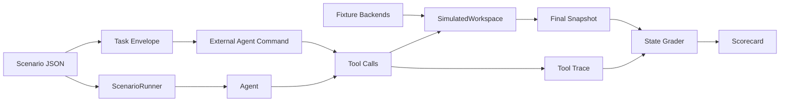

# Architecture

OpenBB Workspace Bench is organized around one stable contract: a scenario describes the initial Workspace state, the agent prompt, the allowed Workspace MCP tools, and deterministic success criteria.



## Components

### Fixture Backends

Fixture backends model the HTTP contract that OpenBB Workspace expects:

- `GET /widgets.json`
- `GET /apps.json`
- one endpoint per widget

They are deterministic and local. The built-in fixtures cover:

- `Bench Equities`
- `Bench Macro`
- `Bench Portfolio`

Each fixture can be used in two ways:

- directly by the simulator
- as a real HTTP server through `workspace-bench serve-fixture`

### SimulatedWorkspace

`SimulatedWorkspace` mirrors the high-value subset of the current `workspace-mcp` tool surface:

- workspace snapshot
- backend and app management
- widget discovery, schema lookup, parameter options, and data fetches
- dashboard creation, tab navigation, and layout mutation
- regular and generated widget creation
- widget read/update/delete

It is not a pixel or browser simulator. It is a deterministic state machine for the Workspace MCP contract. That makes it cheap enough for benchmark development and RL rollouts.

### Runner

The runner:

1. loads a scenario
2. registers fixture backends
3. seeds initial dashboard state
4. executes agent tool calls
5. captures trace and final snapshot
6. invokes the grader

The bundled `oracle` agent replays reference traces from scenario files. The `noop` agent is a failing baseline.

### External Agent Command

`run-agent-command` lets external agents participate without importing the package. The harness writes a public task envelope, sets environment variables, runs the agent command, reads JSONL tool calls, and then executes those calls through the same simulator and grader.

This is a trace-producing protocol. It is intentionally simpler than a fully interactive MCP environment, but it establishes the public BYO-agent result contract and works well for CI baselines.

For local model baselines, `examples/compare_models.py` also provides an
interactive runner. It calls the model once per turn, executes the chosen
Workspace tool through `WorkspaceEpisode.step`, returns the observation to the
model, and grades the same final state.

### Episode API

`WorkspaceEpisode` exposes the step-based interface used by the runner and intended for RL adapters:

```python
from workspace_bench.episode import WorkspaceEpisode
from workspace_bench.models import ToolCall
from workspace_bench.runner import find_scenario

scenario = find_scenario("l1_add_price_widget")
episode = WorkspaceEpisode(scenario)

observation = episode.step(
    ToolCall(
        "list_available_widgets",
        {"origin": "Bench Equities"},
    )
)
reward = episode.grade().score
```

Each `step` appends to the trace. `grade` scores the current state and trace.

### Grader

The grader checks final Workspace state and trace behavior:

- required dashboard name fragments
- required tabs
- required regular widgets
- required generated widgets
- exact or partial `data_args`
- required layout values
- grid bounds and overlap checks
- invalid tool call count
- schema-before-create discipline
- listed widget id discipline
- repeated snapshot behavior

The primary artifact is final Workspace state. Natural-language quality can be layered in later, but should not replace deterministic checks.

## Real Workspace Adapter

The simulator and a real Workspace adapter share the same scenario and grading contracts:

```python
result = workspace.call_tool(ToolCall("create_widget", {...}))
snapshot = workspace.snapshot()
```

`workspace-bench smoke-workspace-mcp` forwards scenario tool calls to a running `workspace-mcp` server at `http://127.0.0.1:8787/mcp`. It emulates the browser websocket bridge with `SimulatedWorkspace`, so the smoke path covers the real MCP streamable HTTP endpoint, tool schemas, server-side validation, browser command translation, and session-context updates.

The smoke bridge is not a high-throughput production adapter. It intentionally owns reset and seeding outside the evaluated model and refuses to replace an already connected browser unless requested. A full real Workspace adapter would use the same pattern but connect to an isolated Workspace browser profile and use `get_workspace_snapshot` or `manage_dashboard read` for final grading.

## Design Constraints

- No live market data in default scenarios.
- Fixture data should be versioned and stable.
- Graders should prefer exact state checks over LLM judging.
- Scenario ids should be durable.
- Tool traces should be preserved for regression analysis and post-training.
- Real Workspace sessions must be isolated per run before using this for high-throughput evaluation.
