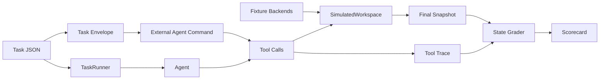

# Architecture

OpenBB Workspace Bench is organized around one stable contract: a task describes the initial Workspace state, the agent prompt, the allowed Workspace MCP tools, and deterministic success criteria.

Tasks are grouped into suites. Two ship bundled: `core`
(`workspace-bench-v1`) — 300 generated, certified tasks for *operating*
the workspace, spanning the equities, macro, portfolio, and Stark enterprise
fixture backends — and `build-openbb-apps`
(`workspace-bench-v2-build-openbb-apps`) — 212 generated, certified tasks
for *building* custom backend apps: the agent writes the `widgets.json` /
`apps.json` payloads a backend serves, validated against the transcribed
production rules.



## Package Layout

The implementation is grouped by responsibility:

- `workspace_bench.core`: tasks, dataclasses, episodes, runner, and graders.
- `workspace_bench.workspace`: deterministic fixture backends, simulator, and live MCP smoke bridge.
- `workspace_bench.agents`: oracle/noop baselines, JSONL command protocol, and model adapter helpers.
- `workspace_bench.reports`: model comparison, metrics, charts, and analysis reports.
- `workspace_bench.exports`: rollout, SFT, and preference data exports.
- `workspace_bench.rl`: Gym-style environment wrappers for RL loops.

The package root intentionally stays small: `workspace_bench.cli` is the command
entry point and `workspace_bench.__init__` exposes a few convenience objects.
Implementation imports should use the focused packages above. Task metadata
uses explicit axes: `capability`, `workflow`, `domain`, and `subdomain`.

## Components

### Fixture Backends

Fixture backends model the HTTP contract that OpenBB Workspace expects:

- `GET /widgets.json`
- `GET /apps.json`
- one endpoint per widget

They are deterministic and local. The built-in fixtures cover:

- `Bench Equities`
- `Bench Macro`
- `Bench Portfolio`
- `Bench Stark Enterprise`

Each fixture can be used in two ways:

- directly by the simulator
- as a real HTTP server through `workspace-bench serve-fixture`

The Stark fixture packages widget and app metadata from the demo enterprise app
catalog into a local backend. It lets tasks cover portfolio command
centers, client meeting prep, vendor monitoring, compliance surveillance,
execution exceptions, and research workflows without requiring a live external
service.

### SimulatedWorkspace

`SimulatedWorkspace` mirrors the high-value subset of the current `workspace-mcp` tool surface:

- workspace snapshot
- backend and app management
- widget discovery, schema lookup, parameter options, and data fetches
- dashboard creation, tab navigation, and layout mutation
- regular and generated widget creation
- widget read/update/delete
- deterministic workspace skills through `get_skill_content`
- MCP resource and prompt retrieval through `read_workspace_resource` and `get_workspace_prompt`
- task delegation envelopes through `assign_tasks_to_agents`

It is not a pixel or browser simulator. It is a deterministic state machine for the Workspace MCP contract. That makes it cheap enough for benchmark development and high-volume automated runs.

### Runner

The runner:

1. loads a task
2. registers fixture backends
3. seeds initial dashboard state
4. executes agent tool calls
5. captures trace and final snapshot
6. invokes the grader

The bundled `oracle` agent replays reference traces from task files. The `noop` agent is a failing baseline.

### External Agent Command

`run-agent-command` lets external agents participate without importing the package. The harness writes a public task envelope, sets environment variables, runs the agent command, reads JSONL tool calls, and then executes those calls through the same simulator and grader.

This is a trace-producing protocol. It is intentionally simpler than a fully interactive MCP environment, but it establishes the public BYO-agent result contract and works well for CI baselines.

For local model baselines, `workspace-bench` also provides an
interactive runner. It calls the model once per turn, executes the chosen
Workspace tool through `WorkspaceEpisode.step`, returns the observation to the
model, and grades the same final state.

### Episode API

`WorkspaceEpisode` exposes the step-based interface used by the runner and intended for RL adapters:

```python
from workspace_bench.core.episode import WorkspaceEpisode
from workspace_bench.core.models import ToolCall
from workspace_bench.core.runner import find_task

task = find_task("gen_t0_create_price_performance_aapl")
episode = WorkspaceEpisode(task)

observation = episode.step(
    ToolCall(
        "list_available_widgets",
        {"origin": "Bench Equities"},
    )
)
reward = episode.grade().score
```

Each `step` appends to the trace. `grade` scores the current state and trace.

### Grader

The grader checks final Workspace state and trace behavior:

- required dashboard name fragments
- required tabs
- required regular widgets
- required generated widgets
- exact or partial `data_args`
- required layout values
- grid bounds and overlap checks
- invalid tool call count
- required tool calls
- required tool result fragments
- required resource reads
- schema-before-create discipline
- listed widget id discipline
- repeated snapshot behavior

The primary artifact is final Workspace state. Natural-language quality can be layered in later, but should not replace deterministic checks.

### Interactive Harness Assistance

The interactive evaluator gives every model the same assistance, so scores
measure guided tool orchestration rather than cold discovery. The full list,
for anyone interpreting or citing the boards:

- a per-task tool reference (descriptions and argument shapes for the
  allowed tools only)
- fixture origin hints (slug-to-display-name mapping) and, for the bundled
  fixtures, a widget-hint sheet with known widget ids and canonical
  `data_args` examples
- tool-name normalization (`functions.`/`tool.` prefixes stripped, fixture
  slugs mapped to display origins)
- lenient action parsing: the first JSON object in the reply is taken as the
  action; trailing prose or extra objects are ignored
- a teaching turn for malformed actions: a reply that cannot be parsed costs
  a turn and gets a corrective message, twice per episode by default, before
  the episode counts as a process failure
- transient provider failures (HTTP 429/5xx, transport errors) retried with
  exponential backoff

Two ablation flags exist for measuring what the scaffolding is worth:
`--no-widget-hints` omits the widget-hint sheet, and `--malformed-retries 0`
disables the teaching turn. Both are recorded in each result's
`run_metadata`, and widget hints exist only for the bundled fixtures — a
private suite runs without them, which should be kept in mind when comparing
scores across suites.

## Real Workspace Adapter

The simulator and a real Workspace adapter share the same task and grading contracts:

```python
result = workspace.call_tool(ToolCall("create_widget", {...}))
snapshot = workspace.snapshot()
```

`workspace-bench smoke-workspace-mcp` forwards task tool calls to a running `workspace-mcp` server at `http://127.0.0.1:8787/mcp`. It emulates the browser websocket bridge with `SimulatedWorkspace`, so the smoke path covers the real MCP streamable HTTP endpoint, tool schemas, server-side validation, browser command translation, and session-context updates.

With `--check-surface`, the smoke command also checks that the server exposes
the expected tool, prompt, and resource surface. This is useful when validating
that Workspace skills and MCP affordances are still reachable from the bench.

The smoke bridge is not a high-throughput production adapter. It intentionally owns reset and seeding outside the evaluated model and refuses to replace an already connected browser unless requested. A full real Workspace adapter would use the same pattern but connect to an isolated Workspace browser profile and use `get_workspace_snapshot` or `manage_dashboard read` for final grading.

## Design Constraints

- No live market data in default tasks.
- Fixture data should be versioned and stable.
- Graders should prefer exact state checks over LLM judging.
- Task ids should be durable.
- Tool traces should be preserved for regression analysis and post-training.
- Real Workspace sessions must be isolated per run before using this for high-throughput evaluation.
