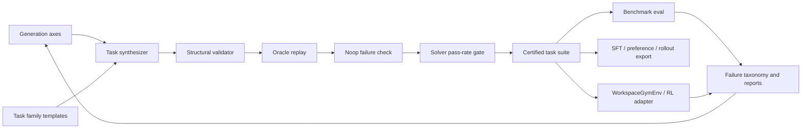

# TMax, General Agent, And The Workspace Bench Direction

This memo analyzes two recent agent-environment posts and maps their ideas onto
OpenBB Workspace Bench:

- WAI, [TMax: A Simple Recipe for Terminal Agents](https://wai-org.com/blog/tmax/), published June 16, 2026.
- Prime Intellect, [General Agent: A Self-Evolving, Synthetic Agent Environment](https://www.primeintellect.ai/blog/general-agent?dark=).

It also uses the current Workspace Bench repository state as evidence. At the
time this memo was written, `workspace-bench validate --suite all
--min-tasks 40 --json` passed with 40 tasks, 40 oracle passes, and 40
noop failures. The manifest reports 11 capabilities, 12 workflows, 9
subdomains, 5 levels, and one top-level domain: finance. All bundled tasks
are currently in the `dev` split.

## Executive View

The right direction is not "make Workspace Bench an RL trainer." The highest
ROI direction is:

1. Keep Workspace Bench as a Terminal-Bench-style, stateful, deterministic
   Workspace Agent benchmark.
2. Add a task/environment factory layer that can generate, evolve, calibrate,
   and certify many Workspace tasks.
3. Let RL, SFT, preference optimization, and model comparison consume the same
   task, trace, and grader contracts.

TMax and General Agent both point to the same core lesson: the scarce asset is
not the RL algorithm. The scarce asset is a large, diverse, executable,
verifiable task distribution with calibrated difficulty. Workspace Bench already
has the seed of this: task JSON, a simulator, MCP-like tools, fixture
backends, oracle traces, final-state graders, trace checks, run artifacts,
exports, and a Gym-style wrapper. What is missing is the systematic factory
that turns those contracts into a broad curriculum.

My opinion: Workspace Bench should position itself as "the benchmark and
environment factory for financial workspace agents." RL should be downstream.
This keeps the product story clear and avoids prematurely optimizing for one
training stack.

## What TMax Contributes

TMax is valuable because it is boring in the right places. It combines a large
environment dataset with a simple RL recipe, then shows generalization across
benchmarks and harnesses.

Key claims from the post:

- TMax-15K contains 14,600 executable terminal RL environments.
- The dataset is generated through a compositional pipeline with explicit
  control over difficulty and diversity.
- Training uses an outcome-only RL recipe based on GRPO/DPPO style training,
  without a learned reward model.
- The authors emphasize executable environments, Docker builds, task files,
  instructions, and automated verifiers.
- They avoid expensive teacher validation during generation. Instead, they use
  build checks and let RL rollout filtering drop tasks with no reward variance.
- They sample tasks across structured axes so the task distribution is balanced
  rather than dominated by one domain.
- They use graded verifiers, thresholds, adversarial corpora, fuzz equivalence,
  and service checks to create more nuanced success signals.
- Results transfer across harnesses, which is important evidence that the model
  learned general terminal skills rather than overfitting one prompt wrapper.
- They explicitly warn that SFT is not always good for stronger post-trained
  models.
- They also highlight long-horizon RL instability: numerical mismatch,
  collapse after hundreds of steps, need for larger groups, and infrastructure
  load from many sandboxes.

The transferable insight is not "use DPPO immediately." It is that a simple RL
algorithm can work once the environment distribution is good enough. For
Workspace Bench, that means we should first build the equivalent of TMax-15K for
Workspace tasks: many executable Workspace tasks with controlled workflow,
tool, data, state, and difficulty axes.

### TMax Concept Mapping

| TMax concept | Workspace Bench analogue | Gap today |
| --- | --- | --- |
| Terminal environment | Workspace task plus fixture backend | Exists for 40 tasks |
| Shell commands | Workspace MCP tool calls | Exists |
| Files and services | Dashboards, tabs, widgets, apps, backend catalogs, fixture data | Exists, but limited catalog diversity |
| Docker build check | Task validation and fixture load check | Exists partially |
| Unit-test verifier | Final-state and trace grader | Exists |
| Graded verifier | Partial score and issue codes | Exists partially |
| Difficulty axes | level, capability, workflow, difficulty, tags | Exists as metadata, not calibrated |
| Hierarchical sampler | Workspace task factory | Missing |
| Soft filtering during RL | Drop all-pass/all-fail rollout groups | Missing from local RL helpers |
| Harness generalization tests | JSONL, interactive model runner, real MCP smoke, future browser runner | Partial |

The TMax warning for Workspace Bench: do not hand-write 40 polished tasks
and call that an RL environment. The serious unlock is a reproducible pipeline
that can produce hundreds or thousands of tasks while preserving verifiers.

## What General Agent Contributes

General Agent is closer to what Workspace Bench should become because its core
object is a stateful tool environment, not a terminal. The post frames task
creation itself as an agent task.

Key claims from the post:

- A task consists of a database, tools that manipulate the database, a natural
  language instruction, a gold solution, and a verification function.
- The environment is synthetic and self-evolving: a synthesizer designs task
  families, and a solver attempts them.
- Tasks evolve through difficulty levels, from `t0` to `t4`.
- Each level is empirically gated by solver pass rate, not just designer intuition.
- Gold replay must flip verification from failing on the initial state to
  passing after the gold solution.
- The current corpus reported by the post has 4,504 tasks, 1,040 domains, and
  more than 8,000 unique tools.
- The authors generated many traces and use them for difficulty estimation,
  SFT, and RL.
- They explicitly analyze failure modes, such as models substituting world
  knowledge for database fields.
- Future work focuses on harder task evolution, domain generalization,
  multi-agent training, and decoupling tasks from harnesses.

This maps very naturally onto Workspace Bench:

- The "database" is Workspace state plus deterministic fixture backends.
- The "tools" are Workspace MCP tools and the app/widget catalog exposed
  through those tools.
- The "instruction" is `Task.prompt`.
- The "gold solution" is `oracle_tool_calls`.
- The "verification function" is `success` plus `grade_task`.
- The "task family" is currently implicit in workflow/capability, but should
  become explicit.
- Difficulty levels map to L0-L5 and can also become family-local levels such as
  `t0` through `t4`.

The most important General Agent idea to copy is empirical gating. Workspace
Bench should stop relying only on labels like `easy`, `medium`, and `hard`.
Those labels should eventually be backed by pass-rate bands from named gating
agents.

### General Agent Concept Mapping

| General Agent concept | Workspace Bench analogue | Gap today |
| --- | --- | --- |
| Pydantic DB | Workspace state model and fixture backend data | Exists, but not exposed as task-family schema |
| Domain-specific tools | Workspace MCP tools plus catalog-specific widget/app schemas | Exists |
| Instruction | Task prompt | Exists |
| Gold solution | Oracle tool calls | Exists |
| Verify function | Deterministic grader | Exists |
| Initial verify fails, gold verify passes | Noop fails, oracle passes | Exists at task level |
| Task family | Workflow/capability clusters | Missing as first-class schema |
| Leveled evolution | L0-L4 levels and difficulty labels | Partial, not family-local |
| Solver pass-rate gating | Model comparison runner | Partial, not in generation loop |
| Synthesizer agent | Task factory agent | Missing |
| Multi-harness solver | JSONL, interactive, MCP sidecar, future browser | Partial |

The General Agent warning for Workspace Bench: if we add generation without
verification and pass-rate gating, we will create benchmark-shaped noise. The
factory must certify tasks, not just write task JSON.

## Current Workspace Bench Strengths

The repository is already aligned with the right architecture in several ways:

- `Task` is the durable task contract.
- `WorkspaceEpisode` is the step-based execution contract.
- `SimulatedWorkspace` is a cheap state machine for Workspace MCP-like tools.
- `grade_task` is deterministic and checks durable Workspace state first.
- `oracle` and `noop` baselines are strong validation primitives.
- the evaluator creates interactive model traces, not only batch JSONL.
- Exports produce rollout, SFT, and preference data.
- `WorkspaceGymEnv` wraps the same episode and grader instead of creating a
  separate RL-only environment.
- Private task suites support BYO enterprise data.
- The Stark pack already points toward broader workflow coverage beyond toy
  equity widgets.

This is a good foundation. The design already agrees with both posts on the
most important point: the source of truth is executable state transition plus
verification, not prose judging.

## What Is Missing

### 1. A First-Class Task Family Schema

The repo has tasks, packs, workflows, capabilities, and difficulty labels.
It does not yet have task families.

A task family should group related tasks that share a backend catalog,
business workflow, and verifier shape, then vary by level. For example:

- `earnings_prep_family`
- `portfolio_morning_review_family`
- `client_meeting_prep_family`
- `vendor_sla_monitoring_family`
- `execution_exception_review_family`

Each family should define:

- family id
- seed backend/catalog assumptions
- persona/desk
- workflow
- allowed tool surface
- state template
- verifier template
- evolution strategies used
- levels and expected pass-rate bands
- oracle/gold trace
- gating results by model

Task fields to add later:

```json
{
  "family_id": "earnings_prep",
  "level": "t2",
  "evolution_strategies": ["larger_catalog", "cross_tab_coupling"],
  "gating": {
    "model": "gpt-4.1",
    "attempts": 20,
    "pass_rate": 0.45,
    "target_band": [0.35, 0.65]
  },
  "task_stats": {
    "oracle_steps": 14,
    "available_tools": 11,
    "available_widgets": 8,
    "initial_widgets": 2,
    "required_artifacts": 5
  }
}
```

This would make difficulty measurable and reproducible.

### 2. A Workspace Task Factory

The missing layer is a generator/evolver/gater pipeline. A practical package
layout would be:

```text
src/workspace_bench/factory/
  axes.py              Structured generation axes
  families.py          Task family schema and templates
  synthesize.py        LLM or rule-based task synthesis
  evolve.py            Level evolution strategies
  validate.py          Structural validation beyond task load
  gate.py              Run solver attempts and accept/reject pass-rate bands
  dedupe.py            Similarity and canary checks
  split.py             Train/dev/validation/test assignment
  write_pack.py        Emit task JSON plus task_suite.json
```

CLI commands:

```bash
workspace-bench synthesize-family --family earnings_prep --levels t0:t4
workspace-bench evolve-task --task l2_earnings_dashboard --target-level t3
workspace-bench gate-pack --task-dir generated/earnings --model gpt-4.1 --attempts 20
workspace-bench calibrate-pack --task-dir generated/earnings --models-file examples/models.json
workspace-bench split-pack --task-dir generated/earnings --strategy family-heldout
workspace-bench certify-pack --task-dir generated/earnings --min-oracle-pass-rate 1.0
```

The first version can be mostly deterministic templates plus small LLM-assisted
variations. It does not need to start with fully autonomous generation.

### 3. Explicit Generation Axes

TMax gets leverage from structured axes. Workspace Bench should do the same.
Suggested axes:

| Axis | Examples | Why it matters |
| --- | --- | --- |
| Workflow | earnings prep, risk review, client meeting, vendor SLA, execution exception | Prevents narrow benchmark overfitting |
| Persona | PM, analyst, trader, compliance officer, IR, data platform lead | Changes task language and priorities |
| Capability | inspect, create, update, repair, instantiate app, delegate, read data | Measures general Workspace skill |
| Artifact target | dashboard, tab, widget, generated note, chart, table, app | Defines durable output |
| Data topology | single backend, cross-backend, app template, generated artifact | Controls retrieval and orchestration |
| Initial-state pathology | blank state, duplicate widget, wrong ticker, missing tab, overlap, stale backend | Creates repair and recovery tasks |
| Constraint type | exact ticker, threshold, budget, ranking, date range, peer group, sector, risk limit | Forces grounded reasoning |
| Tool discovery requirement | list widgets, schema lookup, options lookup, skill read, app list | Tests tool-use discipline |
| Layout rigor | loose, half-width, tab-specific, no overlap, responsive grid | Tests Workspace-specific artifact quality |
| Ambiguity/noise | typo, implicit constraint, conflicting wording, stale label, distractor widget | Tests robustness |
| Verification shape | exact state, numeric threshold, semantic note content, trace discipline, no-regression repair | Determines reward quality |

This would let Workspace Bench describe not just "40 tasks" but the shape
of the task distribution.

### 4. Evolution Strategies

General Agent evolves tasks level by level. Workspace Bench should define a small
taxonomy of Workspace evolution strategies:

- `larger_catalog`: expose more widgets/apps than needed.
- `cross_backend_coupling`: require evidence from multiple backends.
- `cross_tab_coupling`: build or repair state across multiple tabs.
- `stricter_layout`: require exact grid placement, no overlap, and stable tab
  layout.
- `schema_dependency`: require options lookup or schema inspection before
  mutation.
- `stale_state_repair`: seed a wrong ticker, stale date, duplicate widget, or
  outdated note.
- `ambiguous_request`: use realistic analyst language that requires mapping to
  catalog fields.
- `distractor_artifact`: include plausible but wrong widgets or apps.
- `numeric_threshold`: require ranking, cutoff, threshold, or portfolio limit.
- `multi_artifact_consistency`: make the note, table, chart, and widgets agree.
- `delegation`: require `assign_tasks_to_agents` or skill usage.
- `permission_or_policy`: require respecting allowed tools, private backends, or
  compliance constraints.

A family might start as:

- `t0`: inspect one existing widget and create a note.
- `t1`: create one widget after schema discovery.
- `t2`: build a small dashboard with two widgets and a note.
- `t3`: repair a multi-tab dashboard with a cross-backend constraint.
- `t4`: resolve ambiguity, distractors, and strict layout while preserving
  existing useful state.

This is better than global L0-L4 alone because it creates local ladders inside
each business workflow.

### 5. Empirical Difficulty Calibration

Current `difficulty` is hand-assigned. TMax and General Agent both imply that
this should become measured.

A practical gating protocol:

1. Generate or hand-write a candidate task.
2. Validate schema and fixture availability.
3. Assert noop fails.
4. Replay oracle and assert pass.
5. Run one or more gating agents for N attempts.
6. Accept only if pass rate lands in the target band for its level.
7. Store gating metadata in the task or sidecar report.
8. Assign splits after gating, ideally holding out whole families.

Example pass-rate bands:

| Level | Target pass rate with gating model |
| --- | --- |
| `t0` | 0.80 to 1.00 |
| `t1` | 0.65 to 0.90 |
| `t2` | 0.40 to 0.70 |
| `t3` | 0.20 to 0.45 |
| `t4` | 0.05 to 0.25 |

The exact bands matter less than the discipline: difficulty should be measured,
versioned, and tied to a named solver model and harness.

### 6. Split Discipline And Contamination Control

The manifest currently reports only `dev` splits. That is fine for alpha
development but not enough for a serious bench or training environment.

Recommended split policy:

- `train`: generated/public tasks intended for SFT/RL.
- `dev`: visible tasks used to debug agents and adapters.
- `validation`: visible or semi-private tasks used for iteration.
- `test`: held-out tasks used for reporting.
- `hidden`: private/public-leaderboard tasks with prompts and success criteria
  withheld.

Better yet, split by family, not only by task. If `earnings_prep_t0` is in
train and `earnings_prep_t4` is in test, the model may learn family-specific
shortcuts. A stricter split would hold out entire workflows, backends, or
families.

### 7. Harness Decoupling

Both posts care about harnesses. TMax shows transfer across terminal harnesses.
General Agent has local, MCP, and RLM backends.

Workspace Bench should formalize solver backends:

- `jsonl_batch`: current external command protocol.
- `interactive_local`: current the evaluator loop.
- `gym`: `WorkspaceGymEnv`.
- `mcp_sidecar`: current live `workspace-mcp` smoke path.
- `browser_workspace`: future isolated real Workspace browser runner.
- `rl_factory`: adapter for external RL orchestration.

The task should stay the same while the harness changes. The score should
remain comparable. This is essential because OpenBB's real product surface is
MCP plus UI state, while most training infrastructure wants Python or JSON
interfaces.

### 8. Better Verifiers

The existing grader is strong for exact durable state. To scale, it will need
more verifier types:

- numeric checks over widget data, such as "drawdown exceeds threshold"
- cross-widget consistency, such as "note references the same ticker as the
  created widgets"
- no-regression checks, such as "preserve existing useful widgets"
- table/chart content checks for generated widgets
- backend-specific schema invariants
- semantic-but-deterministic checks based on normalized strings and fixture IDs
- optional LLM judge only for narrative quality, never as the sole verifier

TMax's graded verifiers are relevant here. Workspace tasks can often produce a
partial score without an LLM judge: correct backend, correct widget, correct
ticker, correct tab, correct layout, correct note content, no invalid calls.

### 9. Failure Taxonomy

General Agent's failure analysis is especially relevant. Finance agents will
often fail by substituting prior world knowledge for the current workspace
state.

Workspace-specific failure modes to track:

- invented widget ids
- creating before schema lookup
- using generic finance knowledge instead of fixture data
- wrong ticker or stale ticker
- confusing display name with backend origin
- wrong tab target
- layout overlap
- duplicate artifacts
- stopping after answer text without durable state
- over-deleting existing widgets during repair
- treating app templates as instantiated dashboards
- ignoring parameter option lookup
- repeated snapshots without progress
- exceeding turn budget due to search loops

These should become first-class report metrics. They are useful for model
debugging, RL reward shaping, and product tool design.

## RL Implications

The current RL layer is appropriately modest. `WorkspaceGymEnv` returns
observations with the task, allowed tools, last tool result, snapshot, turn
index, and remaining turns. Actions are structured Workspace tool calls. Final
reward comes from `grade_task`, and optional process rewards can shape
valid tool use, schema-before-create, and repeated snapshots.

That is the correct baseline.

What to add next:

- rollout group suite for K attempts per task
- all-pass/all-fail filtering for RL batches
- active sampling of tasks whose pass rate is neither 0 nor 1
- reward reports by issue code
- curriculum sampling by level and measured pass rate
- deterministic seeding and run replay
- train/eval split enforcement in `WorkspaceGymEnv`
- batch reset/step helpers for high-throughput rollout workers
- timeout and max-tool-call semantics aligned with benchmark reports
- optional dense rewards derived only from deterministic checks

What not to do yet:

- Do not make an LLM judge the core reward.
- Do not tightly couple the repo to one trainer.
- Do not train on public oracle traces and then report on the same public
  tasks.
- Do not optimize process reward so heavily that agents learn tool rituals
  without creating correct workspace state.

The best first RL experiment would be small and honest:

1. Create a train pack with generated/evolved tasks.
2. Hold out validation and test families.
3. Collect K rollouts per task using a baseline local model.
4. Filter all-pass/all-fail groups.
5. Run outcome-only RL or an RL-Factory adapter.
6. Evaluate on held-out Workspace Bench tasks through the same grader.
7. Report not only pass rate, but failure taxonomy shifts.

## Applying This To The WorkspaceBench Blog Posts

The two local blog drafts already have the right foundation:

- Part 1 says WorkspaceBench turns workflows into repeatable scored episodes.
- Part 2 says traces become data exports and a step-based environment.

After reading TMax and General Agent, I would sharpen the blog positioning:

### Part 1: Make The Benchmark Identity Stronger

Part 1 should stay benchmark-first. It should make the "durable artifact"
argument even more explicit:

- Workspace agents are not judged by nice answers.
- They are judged by whether they leave behind a correct Workspace state.
- The benchmark is the product contract for agentic Workspace tools.
- The same task can be run against local models, hosted models, custom
  agents, and eventually real Workspace sessions.

Add one small section: "Why final-state grading matters." This can reference the
same pattern as terminal tests and software tests without over-indexing on RL.

### Part 2: Add Distribution And Calibration

Part 2 currently says traces can become SFT, preference, and environment data.
That is true, but the new research suggests a stronger point:

"The trace is reusable, but the task distribution is the asset."

Suggested additions:

- Passing traces are useful, but only if they come from versioned, validated
  tasks.
- RL needs many tasks where rewards have variance.
- Difficulty should be measured by solver pass rates, not only labeled by task
  authors.
- Train/dev/test/hidden splits matter before training starts.
- The next layer after exports is a Workspace task factory.

### Proposed Part 3

The natural third post is:

> WorkspaceBench Part 3: From Eval Suite To Environment Factory

Outline:

1. Hand-written evals are the seed, not the destination.
2. A Workspace task family is initial state, fixture data, tool surface,
   instruction, oracle trace, and verifier.
3. Tasks evolve across levels by adding catalog size, cross-backend coupling,
   repair pathologies, stricter layout, ambiguity, and numeric constraints.
4. Candidate tasks are certified by oracle replay, noop failure, and solver
   pass-rate bands.
5. The same certified tasks power evals, private task suites, SFT exports,
   preference pairs, and RL rollouts.

That post would connect WorkspaceBench to the TMax and General Agent direction
without claiming that OpenBB is already training fronlevel agents.

## Recommended Architecture



The loop should be mostly offline at first. Online self-evolving training can
come later. General Agent's fully trainable synthesizer-solver loop is
interesting, but for OpenBB the immediate value is certified private and public
task-pack generation.

## Concrete Roadmap

### P0: Make The Current Bench Research-Grade

- Add non-dev splits to bundled tasks.
- Add family metadata fields to tasks.
- Add task stats to manifests: oracle steps, tool count, widget catalog
  size, initial widget count, required artifact count.
- Add validation for "initial state fails, oracle state passes" explicitly.
- Add model baseline reports for at least one hosted and one local model.
- Add issue-code aggregate reporting.
- Add hidden/private pack guidance that warns against train/test leakage.

### P1: Build The Factory MVP

- Implement `workspace_bench.factory` with deterministic template generation.
- Define 5 to 8 task families across the existing core and Stark fixtures.
- Add leveled evolution strategies.
- Generate candidate task JSON from templates.
- Certify generated tasks with oracle/noop validation.
- Gate a small generated pack with the evaluator.
- Store gating metadata in a sidecar report first, then consider embedding it
  in task JSON.

### P2: Calibrated Environment Packs

- Generate 200 to 500 tasks across families and levels.
- Split by held-out families.
- Run multiple model baselines with repeated attempts.
- Publish a benchmark card for each pack.
- Add active sampling for RL rollouts.
- Add all-pass/all-fail group filtering.
- Add RL-Factory adapter examples that consume `WorkspaceGymEnv`.

### P3: Real Workspace And Private Data

- Build an isolated real Workspace browser runner.
- Compare simulator and real Workspace grades on oracle traces.
- Support customer/private task factories from internal backend catalogs.
- Keep private graders local.
- Add redaction and manifest-only public reporting.

## Risks

- Synthetic finance tasks can become unrealistic if generation is too free-form.
  Start from real workflow templates and fixture catalogs.
- If oracle traces are public, they cannot also be used as hidden benchmark
  answers.
- If difficulty is calibrated only against one weak solver, stronger models may
  saturate the pack.
- If the verifier is too brittle, agents will fail for irrelevant formatting
  reasons.
- If the verifier is too loose, agents will pass with useless dashboards.
- If process rewards are too strong, agents may learn benchmark rituals instead
  of Workspace outcomes.
- If real Workspace reset is not isolated, live evals will be flaky and
  unsafe to compare.

## Bottom Line

TMax says: large, diverse, executable environments plus simple outcome-only RL
can train useful agents.

General Agent says: make task creation itself systematic, stateful, verified,
evolved, and empirically gated.

Workspace Bench should combine those ideas like this:

- Benchmark first.
- Environment factory second.
- Training adapters third.

The next serious milestone is not "plug in RL-Factory" by itself. It is a
certified Workspace task factory that can produce calibrated train/dev/test
packs from real OpenBB-style workflow templates. Once that exists, RL-Factory,
Gym-style rollouts, SFT exports, preference pairs, and public/private
leaderboards all become downstream consumers of the same asset.
